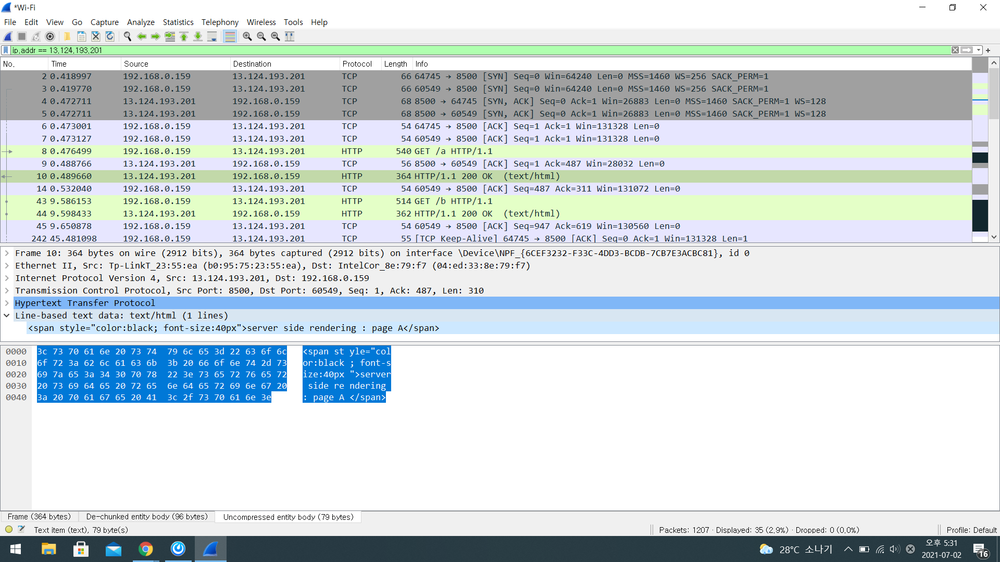
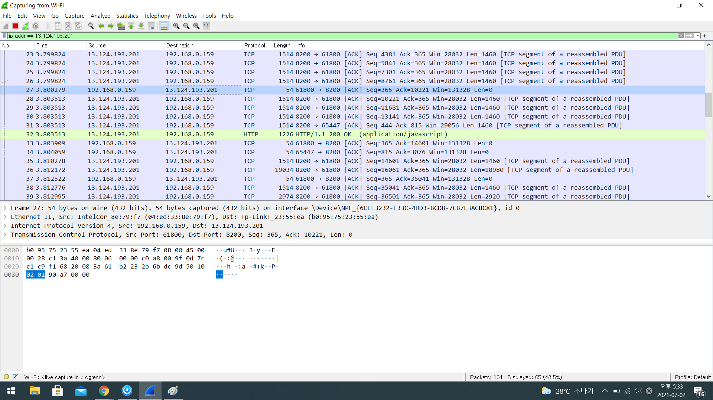
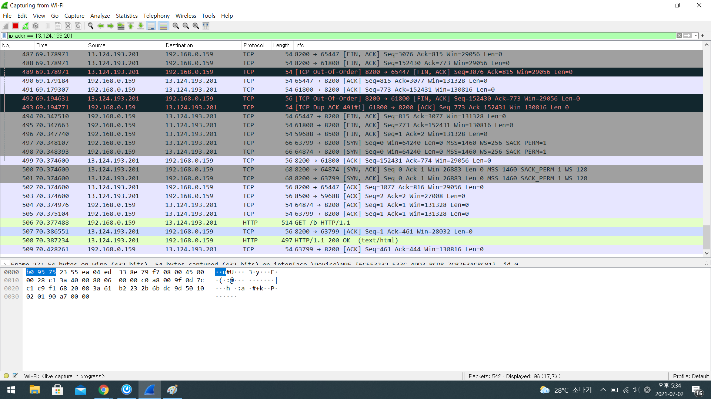

# CSR vs SSR

# 1.

- Vue와 React는 SPA(Single Page Application)으로 CSR(Client Side Rendering)방식으로 View를 만든다.
- PHP는 Multi Page Application(MPA)로 SSR(Server Side Rendering)방식으로 View를 만든다.

# 2. SPA, MPA 접속

각각 SPA와 MPA로 개발된 두 개의 web service가 있다.  
각각 a,b 두 페이지가 있다

| --  | --                           |
| --- | ---------------------------- |
| MPA | http://13.124.193.201:8500/a |
| MPA | http://13.124.193.201:8500/b |
| SPA | http://13.124.193.201:8200/a |
| SPA | http://13.124.193.201:8200/b |

각 service에서 a <-> b 로 page 전환시 화면의 차이는 없어보이지만 내부 동작은 다르다.

# 3. CSR vs SSR

1. CSR : Browser(Client)에서 js에 의해 View(Html)을 동적으로 생성한다. 때문에 page전환이 SSR보다 상대적으로 빠르다. 대신 최초 접속 시, 모든 js(java script)와 static 파일(html, image)를 가져와야 한다. 때문에 최초 접속시 로딩은 SSR에 비해 늦다.

2. SSR : WebServer에서 view를 생성한다. Page가 전환 될 때 마다, client가 server에 View요청을 하고, server는 그것을 생성 후 client에게 보내준다. 때문에 View 전환 속도가 CSR에 비해 상대적으로 늦다. 그리고 page요청이 빈번해 질 수록 CSR에 비해 server부하가 더 커진다.

# 4. Wire Shark

packet을 capture하기 위한 tool

wireshark.org/#download

# 5.MPA

wireshark실행 후 접속

보기는 어렵지만
a - > b로 갈 때 새로운 패킷들이 생성됨

# 6.SPA

a 를 처음 로딩할 때 모두 구현되고
b로 이동할 때는 새로 생성되지 않음
